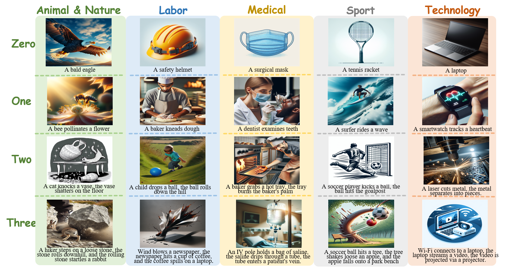

<h1 align="center">StoryBench: A Dataset for Diverse, Explainable,Multi-hop Narrative Text-to-Image Generation</h1>
<!-- Clustering and Ranking: Diversity-preserved Instruction Selection through Expert-aligned Quality Estimation -->
<h4 align="center"> Yuan Ge, Kaiyang Ye, Saihan Chen, Aokai Hao, Xiangnan Ma,Kaiyan Chang,Tong Xiao,Jingbo Zhu</h4>

## News💡
- [2025.07] StoryBench is accepted by NLPCC 2025 Oral!🎉🎉🎉

## StoryBench📚 

**StoryBench** is an evaluation dataset for narrative text-to-image (T2I) generation, characterized by its diversity, explainability, and multi-hop nature. It consists of 728 prompts across five categories: animal-nature, labor, medical, sport, and technology. The assessment of five prominent T2I models, including DALL·E 3 and Midjourney, has revealed that even advanced T2I models have limited capability in generating complex event-narrative images.

      
    An overview of StoryBench with 5 categories. 

